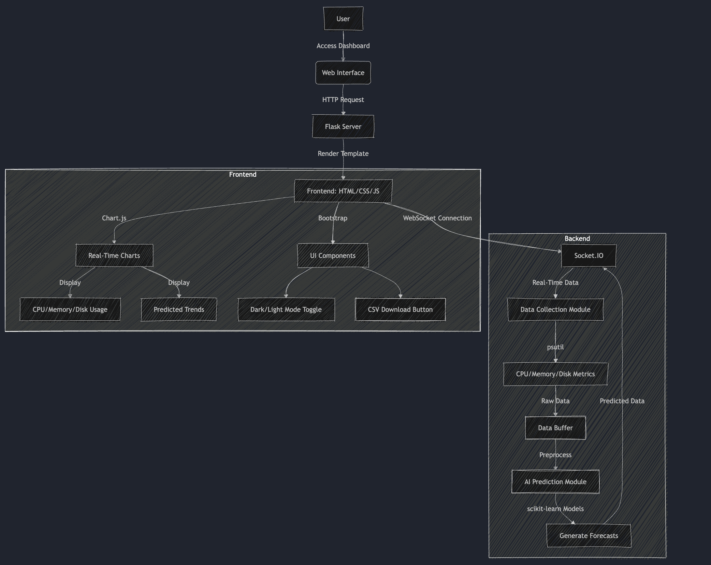
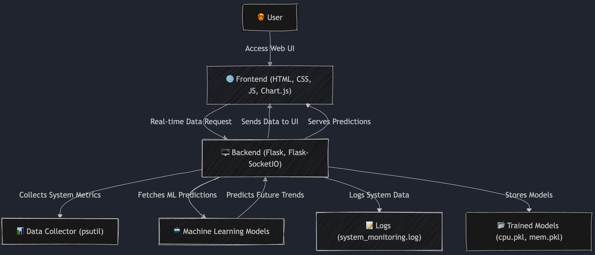

# AI-System-Monitor 🚀

The AI-Powered System Monitor is a real-time system monitoring tool that tracks CPU, memory, and disk usage while leveraging machine learning to predict future trends. It provides a user-friendly web interface to visualize system performance and anticipate potential resource spikes.

## 📌 Overview

The AI-Powered System Monitor is a real-time system monitoring tool that:

✅ Tracks CPU, memory, and disk usage

✅ Uses machine learning to predict future trends

✅ Provides a user-friendly web interface for real-time visualization

## System Architecture

## Flow Diagram

## 📌 Features

✔ Real-time Monitoring – Tracks CPU, memory, and disk usage using psutil

✔ AI Predictions – Predicts future CPU and memory usage with trained ML models

✔ Interactive Dashboard – Displays data using Chart.js with dark mode support

✔ Flask-SocketIO – Enables real-time data streaming to the frontend

✔ CSV Export – Allows users to download system logs (to be implemented)

## 📌 Project Structure

system-monitor/
│── logs/                     # Stores system monitoring logs

│   └── system_monitoring.log # Log file

│── models/                   # Contains trained ML models (CPU, memory, disk)

│   ├── cpu_model.pkl         # CPU prediction model

│   ├── memory_model.pkl      # Memory prediction model

│   └── disk_model.pkl        # Disk usage prediction model

│── static/                   # Holds frontend assets (CSS, JS)

│   └── styles.css            # Custom CSS (if needed)

│── templates/                # Contains HTML files for the web UI

│   └── index.html            # Main HTML file

│── app.py                    # Main Flask app serving UI & handling backend logic

│── generate_models.py        # Script to generate & train ML models

│── pro1.py                   # Fetches real-time system metrics

│── train_disk_model.py       # Training script for disk usage prediction

│── requirements.txt          # List of dependencies

│── README.md                 # Project documentation

## Installation Guide
Follow these steps to set up the system monitoring tool:
1. Install dependencies using `pip install -r requirements.txt`
2. Start the application using `python3 app.py`

## 📌 Installation & Setup

### 1️⃣ Prerequisites

Ensure you have Python 3.x installed.

### 2️⃣ Install Dependencies

Run the following command:

    pip install -r requirements.txt

### 3️⃣ Start the Server

Run the following commands in order:

    python3 generate_models.py

    python3 train_disk_model.py

    python3 app.py

### 4️⃣ Access the Web Interface

Open your browser and visit:

🔗 http://127.0.0.1:5000

## 📌 How It Works

### 🔹 Data Collection (Backend)

✔ Uses psutil to collect CPU, memory, and disk usage.

✔ Streams data to the frontend using Flask-SocketIO.

### 🔹 Machine Learning Model

✔ Predicts future CPU and memory usage using trained models (cpu_model.pkl, memory_model.pkl).

✔ Uses scikit-learn for training models.

### 🔹 Data Visualization (Frontend)

✔ Uses Chart.js for real-time graphs.

✔ Supports dark mode toggle for better UX.

## 📌 Technologies Used

✅ Backend: Python, Flask, Flask-SocketIO, psutil, joblib, numpy, scikit-learn

✅ Frontend: HTML, CSS, JavaScript, Chart.js, Socket.IO

## 📌 Future Improvements 🚀

🔹 Alert System – Notify users when resource usage crosses a threshold

🔹 Enhanced ML Models – Improve accuracy with more training data

🔹 CSV Download – Allow users to download logs directly from the UI

🔹 Containerization – Dockerize the project for easier deployment

## 📌 License
This project is open-source and available under the MIT License.

# 🎯 Happy Coding! 🚀
